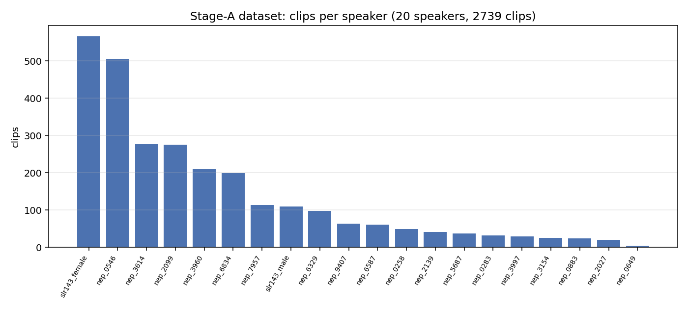
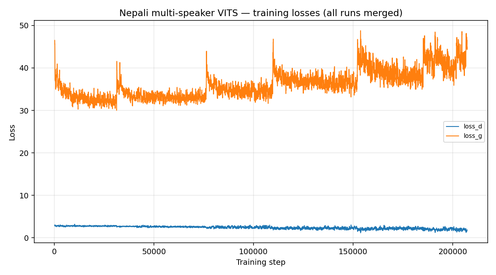

# An Offline Multi-Speaker Nepali Text-to-Speech System on Consumer Hardware

**A reproducible VITS pipeline trained from public data on a single 8 GB laptop GPU**

*Working document — training in progress. Figures and numbers regenerate from live logs via
`scripts/plot_training.py`. Last build: step ≈ 17.5k.*

---

## Abstract

We present a fully offline, **multi-speaker Nepali (Devanagari) text-to-speech (TTS)** system built
entirely from public data and trained on a single consumer **8 GB laptop GPU**. The system fine-tunes a
**VITS** model (via *piper1-gpl*) from an English warm-start checkpoint, using **espeak-ng** for Nepali
grapheme-to-phoneme conversion, and exports to **ONNX** for dependency-light offline inference. Beyond the
model, we document a **reproducible engineering recipe** for training on a brand-new **NVIDIA Blackwell
(sm_120)** laptop GPU under WSL2 with PyTorch 2.11 — a configuration for which several failure modes are
currently undocumented. On ~3.8 hours of curated speech from 20 speakers, the generator loss decreases
monotonically (47 → 31.4) and the model produces intelligible-trending Nepali across multiple selectable
voices. We release all code, configs, and a step-by-step reproduction guide.

---

## 1. Introduction

Nepali is a low-resource language for speech technology. High-quality TTS typically assumes (a) large clean
single-speaker corpora, (b) datacenter GPUs, and (c) online inference. We target the opposite regime:
**public multi-speaker data, a single 8 GB laptop GPU, and fully offline deployment.**

**Contributions.**
1. An end-to-end, reproducible pipeline (data → preprocessing → training → ONNX) for multi-speaker Nepali TTS.
2. A **Nepali text frontend** built on espeak-ng with an empirical accuracy analysis (§6.3).
3. A documented **engineering recipe** for VITS training on Blackwell+WSL2+PyTorch-2.11 (Appendix A) — the
   primary practical obstacle, with several non-obvious fixes.
4. All artifacts open and reproducible from a clean machine.

---

## 2. Related work & components

- **VITS** (Kim et al., 2021) — end-to-end TTS combining a conditional VAE, normalizing flows, and adversarial
  training; jointly learns acoustic features and a HiFi-GAN-style vocoder. Strong quality, supports multi-speaker.
- **Piper / piper1-gpl** (OHF-Voice / Home Assistant) — a lightweight VITS training + ONNX-inference toolkit
  designed for fast offline TTS; provides espeak-ng phonemization and multi-speaker support.
- **Meta MMS-TTS** (`facebook/mms-tts-npl`) — a pretrained single-speaker Nepali VITS; used here as a **baseline**.
- **espeak-ng** — rule-based multilingual phonemizer with a Nepali (`ne`) voice; our G2P frontend.

---

## 3. Data

We use public **OpenSLR** corpora.

| ID | Content | License | Role |
|---|---|---|---|
| **SLR43** | High-quality multi-speaker TTS, female (ne-NP) | CC BY-SA 4.0 | Stage A (primary) |
| **SLR143** | Nepali TTS, male + female | CC BY-NC-SA 4.0 | Stage A (adds male) |
| **SLR54** | Large Nepali ASR, ~157k utterances | CC BY-SA 4.0 | Stage B (scale-up) |

**Stage A (current):** 2,739 clips, **3.83 h**, **20 speakers**, resampled to 22.05 kHz mono, peak-normalized,
silence-trimmed. The corpus is heavily imbalanced (Fig. 2): the largest speaker has 566 clips, the median ~60,
and only one male speaker (109 clips). Multi-speaker training shares phonetic learning across all speakers,
which mitigates (but does not eliminate) the scarcity for data-poor voices.

*Figure 2. Clips per speaker in the Stage-A corpus (20 speakers, 2,739 clips).*

---

## 4. Method

### 4.1 Architecture
Multi-speaker **VITS** (`model_g` SynthesizerTrn ≈ 30 M params; `model_d` multi-period discriminator ≈ 47 M).
A learned speaker embedding conditions the model; voices are selected at inference by integer speaker id.

### 4.2 Nepali text frontend
Devanagari → phonemes via **espeak-ng `ne`** (phoneme set of 256 symbols). This handles consonant conjuncts,
schwa, and number expansion natively (§6.3). Text normalization (numbers, punctuation) is largely delegated to
espeak-ng in the current version; a correction lexicon is future work (§7).

### 4.3 Warm-start (transfer learning)
With only ~3.8 h of data, training from scratch is impractical on one GPU. We **vocoder-warm-start** from the
English `en_US-lessac-medium` checkpoint: VITS shares an IPA-based phoneme inventory across languages, so the
language-agnostic vocoder transfers, and the model adapts to Nepali phonetics + speaker identities. (A full
encoder+flow warm-start is blocked by the single→multi-speaker architecture mismatch and is future work.)

### 4.4 Offline export
Trained checkpoints export to **ONNX** (`torch.onnx.export`, legacy exporter) and run via `onnxruntime` on CPU
— no GPU or network required at inference. This is the deployable artifact.

### 4.5 Deployment: offline web frontend
A **Gradio** web app (`frontend/app.py`) provides interactive use: enter Nepali text, pick one of the 20
speaker voices, adjust speed/variation, get audio. It loads the exported ONNX, runs `onnxruntime` on CPU, and
serves a browser UI on `localhost` — fully offline (reachable from the Windows browser via WSL `localhost`
forwarding). It re-exports the latest checkpoint on launch, so the served voice tracks training. A planned
extension accepts **romanized** (Latin-script) Nepali and code-mixed Nepali-English input via transliteration
to Devanagari (§7).

---

## 5. Experimental setup

| | |
|---|---|
| GPU | NVIDIA RTX 5050 Laptop, 8 GB, Blackwell **sm_120** |
| Stack | WSL2 Ubuntu-24.04, PyTorch **2.11.0+cu128**, driver **610.47** |
| Precision | fp32 (bf16/fp16 unusable — see Appendix A) |
| Batch size | 2 (8 GB-constrained) + 4 dataloader workers |
| Optimizer / schedule | piper1-gpl defaults (AdamW, exp. LR decay) |
| Warm-start | `en_US-lessac-medium` (vocoder) |
| Checkpointing | every 100 steps; auto-resume loop for fault tolerance |

Training runs unattended via an **auto-resume loop** that checkpoints frequently and restarts from the last
checkpoint after any GPU fault (Appendix A.4).

---

## 6. Results

### 6.1 Training dynamics

*Figure 1. Generator (`loss_g`) and discriminator (`loss_d`) losses, all runs merged by step.*

The generator loss falls sharply (≈47 → ≈37) within the first few hundred steps as the warm-start adapts, then
declines steadily to **≈31.4** by step 17.5k and is still trending down. The discriminator loss stays balanced
at ≈2.7 — the expected stable adversarial equilibrium (no mode collapse, no discriminator runaway).

### 6.2 Qualitative samples
Audio for fixed test sentences across speakers is in `eval/ne_model/`. At the current step the output has
human timbre (vocoder transfer) and Nepali prosody, with clarity improving over training. Re-synthesize the
latest checkpoint anytime with `scripts/13_sample.sh`.

### 6.3 Frontend (G2P) accuracy
Empirical check of espeak-ng `ne` on representative inputs:

| Phenomenon | Example | espeak-ng output | Verdict |
|---|---|---|---|
| Consonant conjuncts | क्ष, क्य, स्त | `kʂ`, `kːj`, `st` | ✅ correct |
| Schwa deletion | नमस्ते | `nəmʌsteː` | ✅ correct |
| Number expansion | २०२६ | "दुई हजार छब्बिस" | ✅ correct |
| Nasalization (ँ) | तपाईं / काठमाडौं | `…n` / `…m` | ⚠️ flattened |

The frontend is largely correct; nasalization and a few phoneme nuances are the main targets for the future
correction lexicon (§7).

### 6.4 Evaluation methodology (objective intelligibility)
Our planned objective metric is **ASR round-trip Character Error Rate (CER)**: synthesize a held-out test set,
transcribe with a Nepali ASR (Whisper-large-v3 or MMS-ASR), and compute CER/WER against the input text. Lower
CER ⇒ more intelligible/accurate. The harness (`scripts/eval_cer.py`) is prepared; meaningful numbers require
further training and are reported when the loss plateaus. We will report CER against two baselines:
rule-based **espeak-ng** and neural **MMS-tts-npl**.

---

## 7. Limitations & future work

- **Early training.** Numbers above are mid-training; quality and CER will improve substantially.
- **Data scarcity / imbalance.** ~3.8 h, female-heavy, one male voice. Stage B (SLR54, ~157k utts) adds many
  speakers including male; expected to be the largest quality lever.
- **Frontend.** Add a Nepali normalization + **correction lexicon** (nasalization, loanwords, dates, currency).
- **Warm-start depth.** Only the vocoder transfers today; a full lenient encoder/flow warm-start is future work.
- **Input flexibility (in progress).** Many Nepali speakers type **romanized Nepali** in Latin script and mix
  English freely (e.g. *"hello sanchai hunuhuncha tapai"*). We are adding a frontend that **transliterates
  informal romanized Nepali to Devanagari** and handles code-mixed Nepali-English, so users need not type
  Devanagari.
- **Code-switched natural tone.** Producing a genuinely casual, code-switched Nepali-English voice (like real
  speakers) is a data + modeling problem (code-mixed training data, consistent English-word phonemization) —
  a longer-term phase.
- **Expressivity / emotions.** No public Nepali emotion-labeled corpus exists; expressive TTS requires either
  recording emotion-labeled data or a reference/style-encoder architecture — a separate research phase.

---

## 8. Conclusion
A reproducible, fully offline multi-speaker Nepali TTS system is achievable from public data on a single 8 GB
laptop GPU. The principal obstacle is not modeling but **toolchain engineering on brand-new hardware**, which
we document so others can reproduce it. Training is healthy and ongoing; the pipeline, data, and recipe are
released in full.

---

## Appendix A — Reproducible recipe for VITS training on Blackwell (sm_120) + WSL2 + PyTorch 2.11

These failure modes cost significant effort and are largely undocumented as of this writing.

1. **TorchScript fused op crash.** VITS's `@torch.jit.script fused_add_tanh_sigmoid_multiply` fails in the
   TorchScript interpreter on sm_120 (mis-reported as a 20 MiB OOM). **Fix:** `export PYTORCH_JIT=0`.
2. **`expandable_segments` breaks under WSL2.** `PYTORCH_CUDA_ALLOC_CONF=expandable_segments:True` uses CUDA
   virtual-memory APIs unsupported in WSL2 → spurious "16 billion GB in use" OOM. **Fix:** do not set it.
3. **Precision.** `bf16-mixed` → cuFFT cannot STFT bf16 (crash). `16-mixed` → experimental ComplexHalf FFT is
   unstable on Blackwell. **Fix:** `32-true` (fp32).
4. **Intermittent backward-pass `CUDA error: unknown error`** at random steps — a known sm_120 driver fault.
   **Fixes:** NVIDIA driver **596.36 → 610.47** (roughly halved the rate), batch size 2, and an **auto-resume
   loop** with frequent checkpoints to make training fault-tolerant and unattended.
5. **Dataloader starvation.** 0 workers + low process priority starved the GPU (~20× slowdown). **Fix:**
   `--data.num_workers 4`, normal priority; cap WSL RAM/cores via `.wslconfig` for host responsiveness.
6. **ONNX export.** PyTorch 2.11's dynamo exporter fails on VITS spline flows; use the legacy exporter
   (`dynamo=False`) and install `onnxscript`.

## References
- J. Kim, J. Kong, J. Son. *Conditional Variational Autoencoder with Adversarial Learning for End-to-End TTS (VITS)*. ICML 2021.
- OHF-Voice. *piper1-gpl*. https://github.com/OHF-Voice/piper1-gpl
- Pratap et al. *Scaling Speech Technology to 1,000+ Languages (MMS)*. 2023.
- OpenSLR datasets SLR43, SLR54, SLR143. https://www.openslr.org
